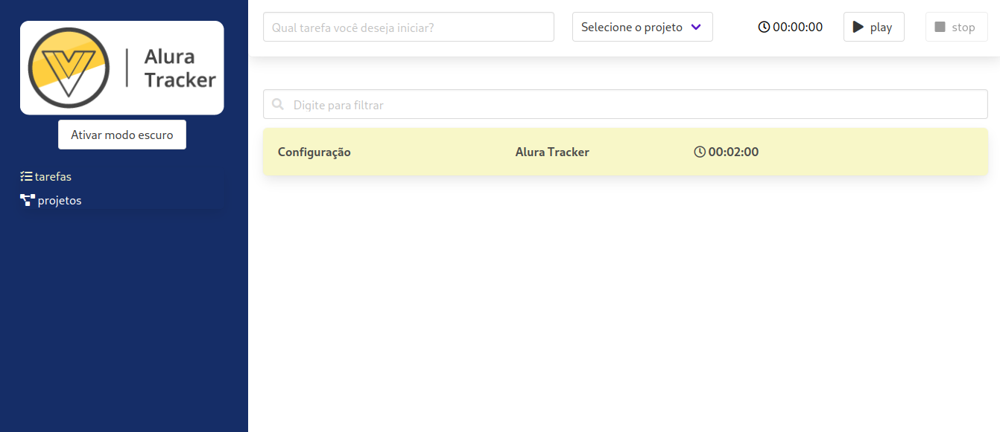
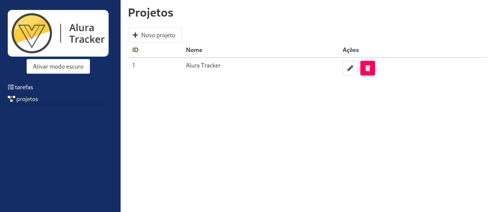

# Projeto vueJs3 :)

### Projeto realizado com a transição de Options API para Composition API.

##### Curso ALURA- Vue3: Composition API e Vuex.
### Project compound
```
Bulma, Vuex, Axios e Vue-router.
```
## Imagens




### Project setup
```
npm install
```

### Compiles and hot-reloads for development
```
npm run serve
```

### Compiles and minifies for production
```
npm run build
```

### Lints and fixes files
```
npm run lint
```

### Customize configuration
See [Configuration Reference](https://cli.vuejs.org/config/).
